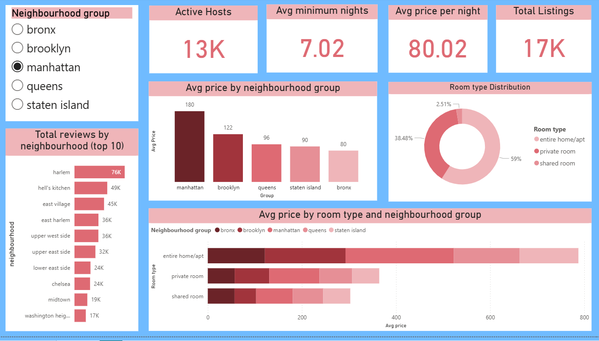

# End-to-End-NYC-Airbnb-Data-Analytics-with-Sentiment-Analysis-EDA-Power-BI-Dashboard

## 📌 Project Overview
This project presents an end-to-end **data analytics workflow** on NYC Airbnb listings, focusing on **data cleaning, exploratory data analysis (EDA), sentiment-based pricing insights, statistical hypothesis testing, and interactive dashboarding**.  
The goal is to uncover actionable insights into **pricing behavior, customer sentiment impact, and listing characteristics** using Python, SQL-style analytics, and Power BI.

---

## 🛠️ Tech Stack
- **Python** (Pandas, NumPy, Matplotlib, Seaborn, SciPy)
- **Statistical Testing** (Kruskal–Wallis, Dunn’s Post-hoc Test)
- **NLP / Sentiment Analysis**
- **Power BI** (Interactive dashboards, KPIs)
- **Jupyter Notebook**

---

## 📂 Project Structure
```
NYC-Airbnb-Analysis/
│
├── 01_Data_cleaning_&_EDA.ipynb
├── 02_Sentiment_generation.ipynb
├── 03_Hypothesis_Testing.ipynb
├── 04_Dashboard.pbix
└── README.md
```

---

## 📁 File Descriptions

### 1️⃣ `01_Data_cleaning_&_EDA.ipynb`
- End-to-end **data cleaning and preprocessing**
- Handling:
  - Missing values
  - Duplicates
  - Outliers
  - Skewed distributions
- Performed **univariate and multivariate EDA**
- Generated insights on:
  - Price distribution
  - Room types
  - Borough-level trends
  - Review and availability patterns

---

### 2️⃣ `02_Sentiment_generation.ipynb`
- Performed **sentiment analysis on Airbnb reviews**
- Classified reviews into sentiment categories (e.g., Positive, Neutral, Negative)
- Created sentiment-based features for downstream analysis
- Prepared sentiment-enriched dataset for hypothesis testing

---

### 3️⃣ `03_Hypothesis_Testing.ipynb`
- Formulated and tested hypotheses on **pricing differences across sentiment groups**
- Verified statistical assumptions
- Applied:
  - **Kruskal–Wallis Test** (non-parametric)
  - **Dunn’s Post-hoc Analysis**
- Key Result:
  - Statistically significant pricing differences across all sentiment categories  
  *(H = 31.9, p < 0.001)*

---

### 4️⃣ `04_Dashboard.pbix`
- Interactive **Power BI dashboard**
- Key features:
  - KPI cards for pricing and listing metrics
  - Borough and room-type comparisons
  - Sentiment-driven pricing insights
  - Filters for dynamic exploration
- Designed for **decision-ready insights**



---

## 📊 Key Insights
- Airbnb prices are **highly skewed**, with premium listings driving a disproportionate share of revenue
- **Customer sentiment significantly impacts pricing**
- Strong borough-wise and room-type pricing variations
- Sentiment-aware pricing strategies can improve revenue optimization
---

## 📈 Business Relevance
This analysis demonstrates how **data-driven decision-making**, combined with **statistical rigor and visualization**, can support:
- Pricing optimization
- Customer experience analysis
- Strategic marketplace insights

---

## 👤 Author
**Diya**  
Aspiring Data Analyst | Python • SQL • Power BI • Statistics  

---
